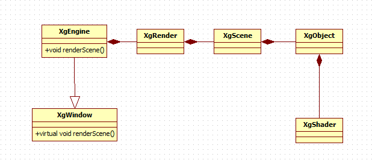

# Xg - OpenglGl Object Oriented Game Engine

Xg has been a few years in the making.  But through tedious phototyping and research the Xg Game Engine has been realized.  The idea was simple ... create a completely object oriented game engine the hid all underline graphics API.

# Xg - Game Engine

# Xgl - Language

# Xgv - GUI
